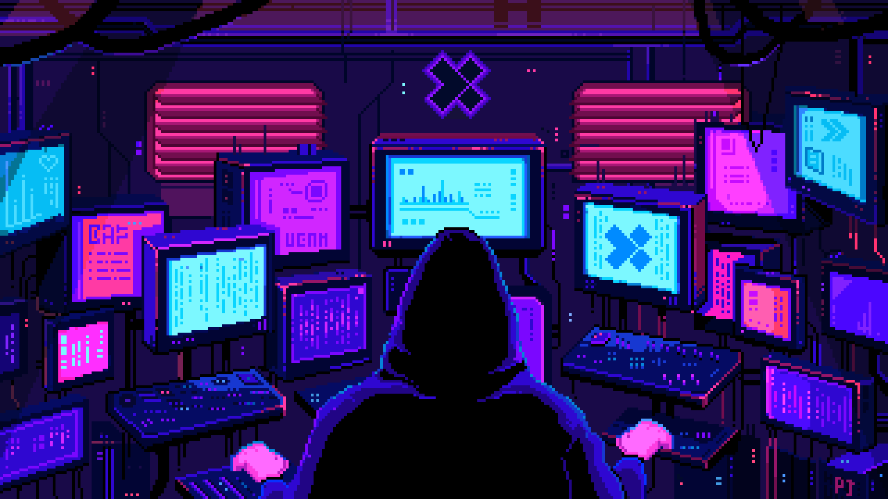

# 👋 Hi there! I'm Matteo Facci

## :open_book: About me

Sports, motors, music, and technology have all been my passions since I was a child. These aspects have contributed to who I am today. 

I have always participated in team sports such as football while never neglecting my other interests and hobbies, such as the construction of small robotic models. 
I like to think of myself as a technophile obsessed with the latest devices, a big fan of Formula 1, a videogames enthusiast, a great problem solver, and who knows, maybe even a decent pianist.

All of these factors helped me get through my studies at Sapienza, University of Rome. As a passionate person, I had access to more resources than I could have imagined. Beginning with my BE in Information Engineering and continuing through my MS in Control Engineering, I studied new languages, algorithms, controllers, and higher mathematics with the same enthusiasm that I had as a child. And it was here that I realized just how much more there was to learn.

The two years I spent in the Sapienza Corse Formula Student Racing Team, with an amazing group of people from the same university but with different engineering bases or courses of study, were one of the most valuable experiences of my student career. This program allowed me to combine all of my interests and abilities into one, which was working in an engineering team, in a dynamic environment, surrounded by motors and technology, in order to show our signs of progress and results and then compete during the Formula Student Championship events and races in Italy and abroad.

These interests, I believe, will remain the same in the future. 
There is undoubtedly more to learn, more problems to solve, and more to build. 
And for that, I am eternally grateful.
<!--
**matteofacci/matteofacci** is a ✨ _special_ ✨ repository because its `README.md` (this file) appears on your GitHub profile.

Here are some ideas to get you started:

- 🔭 I’m currently working on ...
- 🌱 I’m currently learning ...
- 👯 I’m looking to collaborate on ...
- 🤔 I’m looking for help with ...
- 💬 Ask me about ...
- 📫 How to reach me: ...
- 😄 Pronouns: ...
- ⚡ Fun fact: ...
-->
